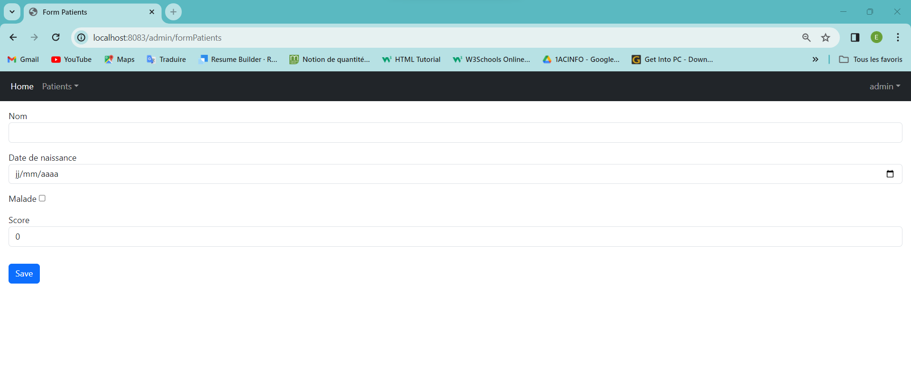

<h1>Conception</h1>

<h1>Authentification</h1>

<h1>L'interface Admin</h1>

<h1>Supprimer un patient de la liste</h1>

<h1>Suppression avec succées</h1>

<h1>Chercher un patient</h1>

<h1>Ajouter un patient</h1>

<h1>Modufier les informations d'un patient</h1>

<h2>Modification avec succées</h2>

<h1>Interface utilisateur</h1>

<h2> si un utilisateur tente d'accéder à une ressource pour laquelle il n'a pas les autorisations nécessaires, il sera redirigé vers la page suivante :</h2>

